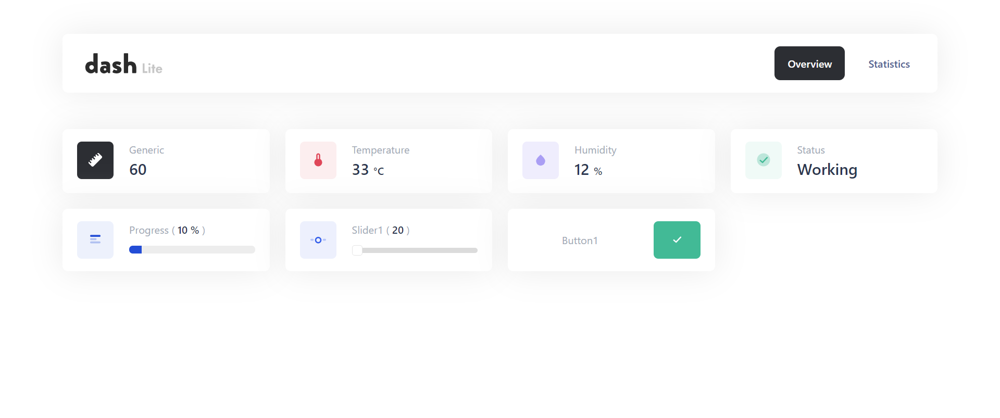

# esphome-dashboard
The objective of this external esphome component is to easily create a webpage in the esphome environment. 
esphome has an extensive sets of sensor interfaces and automations but lacks the configurable onboard webpage. 
So hopefully this can achieve most use cases, please file a feature request if there is something missing.

## Preview


## Prerequisite
Using the esphome wrapped dashboard requires the esphome building environment, either natively or using a docker container. 
Please see the esphome [documention](https://esphome.io/guides/getting_started_command_line.html) on this matter.

**Get acquainted with the documentation of the dashboard library [ESP-Dash](https://ayushsharma82.github.io/ESP-DASH/).**

## Getting started

Add this repository in your ESPHome config file:

```yaml
external_components:
  - source: github://jbbjarnason/esphome-dashboard
```

Add the ESP-Dash repository as library in the same file:

```yaml
  libraries:
    - https://github.com/jbbjarnason/ESP-DASH
```

Now you should be able to configure the dashboard, an example:

```yaml
dashboard:
  id: esp_dash
  port: 80
  charts:
    - id: barchart 
      # Valid types are currently only "bar"
      type: "bar"
      name: "Chart in front page"
  cards:
    - id: heater_increase_temp
      type: "button"
      name: "+1 °C"
      lambda: |-
        ESP_LOGD("TAG", "Button value %d", value));
  tabs:
    - id: adjust_tub
      name: "Example 1"
      navigation_name: "Example 1"
      header: "Example 1"
      cards:
        - id: heater_target_temp
          # Valid types are: 
          # generic, temperature, humidity, status, slider, button and progress
          type: "slider"  
          name: "Target Temperature"
          unit_of_measurement: "°C"
          default_value: 37
          min_value: 5
          max_value: 45
          lambda: |-
            ESP_LOGD("TAG", "new value: %d", value);
        - id: heater_sensor_temp
          type: "temperature"
          name: "Sensor Temperature"
          unit_of_measurement: "°C"
    - id: advanced_tab
      name: "Example 2"
      navigation_name: "Example 2"
      header: "Example 2"
      charts:
        - id: power
          type: "bar"
          name: "A second tab chart"
```

## Configuration variables:

### dashboard

- id(Optional, [ID](https://esphome.io/guides/configuration-types.html#config-id)): The variable name in the generated code, this id can be used in lambdas.
- port(Optional, int): The port the web server should open its socket on.
- auth(Optional): Enables basic authentication with username and password.
    - username(**Required**, string): The username to use for authentication.
    - password(**Required**, string): The password to check for authentication.
- statistics(Optional, bool): Display a statistics tab of controller features. (default ON)
- cards(Optional, list): List of cards to appear on front page(overview).
    - id(Optional, [ID](https://esphome.io/guides/configuration-types.html#config-id)): The variable name in the generated code, this id can be used in lambdas.
    - type(**Required**, enum): Choose one: "generic", "temperature", "humidity", "status", "slider", "button", "progress"
    - name(**Required**, string): Display name of the card.
    - unit_of_measurement(Optional, string): Smaller font after the name, convenient for units.
    - min_value(Optional, int): Minimum value of the card, convenient for "slider" card.
    - max_value(Optional, int): Maximum value of the card, convenient for "slider" card.
    - default_value(Optional): Can either be a string, int or float.
    - lambda(Optional, [lambda](https://esphome.io/guides/automations.html?highlight=lambda#config-lambda)): C++ code to execute when an event from the card, button push or slider changed.
- charts(Optional, list): List of Charts to appear on front page(overview).
    - id(Optional, [ID](https://esphome.io/guides/configuration-types.html#config-id)): The variable name in the generated code, this id can be used in lambdas.
    - type(**Required**, enum): Choose one: "bar".
    - name(**Required**, string): Display name of the chart.
- tabs(Optional, list): List of tabs to generate.
    - id(Optional, [ID](https://esphome.io/guides/configuration-types.html#config-id)): The variable name in the generated code, this id can be used in lambdas.
    - name(**Required**, string): Name of tab, appears in title bar and url.
    - navigation_name(**Required**, string): Navigation name, appears in navigation bar on the webpage.
    - header(Optional, string): Header on webpage, appears in the top left corner of the navigation bar.
    - cards(Optional, list): List of cards to appear in this tab.
        - id(Optional, [ID](https://esphome.io/guides/configuration-types.html#config-id)): The variable name in the generated code, this id can be used in lambdas.
        - type(**Required**, enum): Choose one: "generic", "temperature", "humidity", "status", "slider", "button", "progress"
        - name(**Required**, string): Display name of the card.
        - unit_of_measurement(Optional, string): Smaller font after the name, convenient for units.
        - min_value(Optional, int): Minimum value of the card, convenient for "slider" card.
        - max_value(Optional, int): Maximum value of the card, convenient for "slider" card.
        - default_value(Optional): Can either be a string, int or float.
        - lambda(Optional, [lambda](https://esphome.io/guides/automations.html?highlight=lambda#config-lambda)): C++ code to execute when an event from the card, button push or slider changed.
    - charts(Optional, list): List of charts to appear in this tab.
      - id(Optional, [ID](https://esphome.io/guides/configuration-types.html#config-id)): The variable name in the generated code, this id can be used in lambdas.
      - type(**Required**, enum): Choose one: "bar".
      - name(**Required**, string): Display name of the chart.

## Relevant API reference
A brief excerpt of the API, which is relevant to use inside callbacks is as follows:

### Class ESPDash
Send updates to frontend(browser).
```c++
void sendUpdates();
```

### Class Card
Update card value, currently does not send the update to the browser, please refer to the section above.
```c++
void update(int value);
void update(int value, const char* symbol);
void update(bool value);
void update(bool value, const char* symbol);
void update(float value);
void update(float value, const char* symbol);
void update(const char* value);
void update(const char* value, const char* symbol);
void update(const String &value);
void update(const String &value, const char* symbol);
```

### Class Chart
Update axes, currently does not send the update to the browser, please refer to the section above.
```c++
void updateX(int arr_x[], size_t x_size);
void updateX(float arr_x[], size_t x_size);
void updateX(String arr_x[], size_t x_size);
void updateY(int arr_y[], size_t y_size);
void updateY(float arr_y[], size_t y_size);
```
